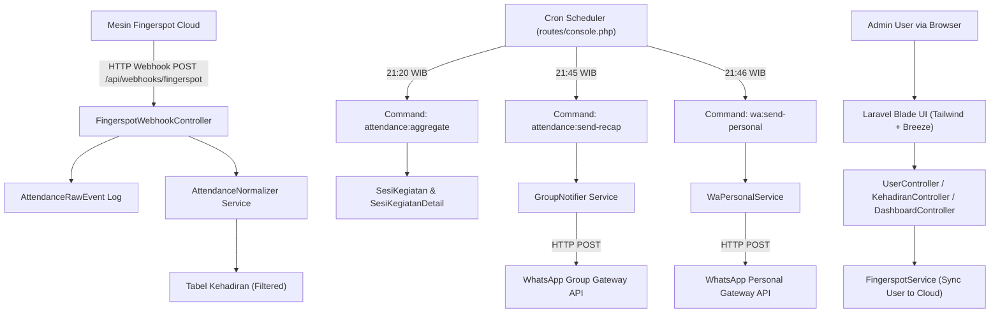
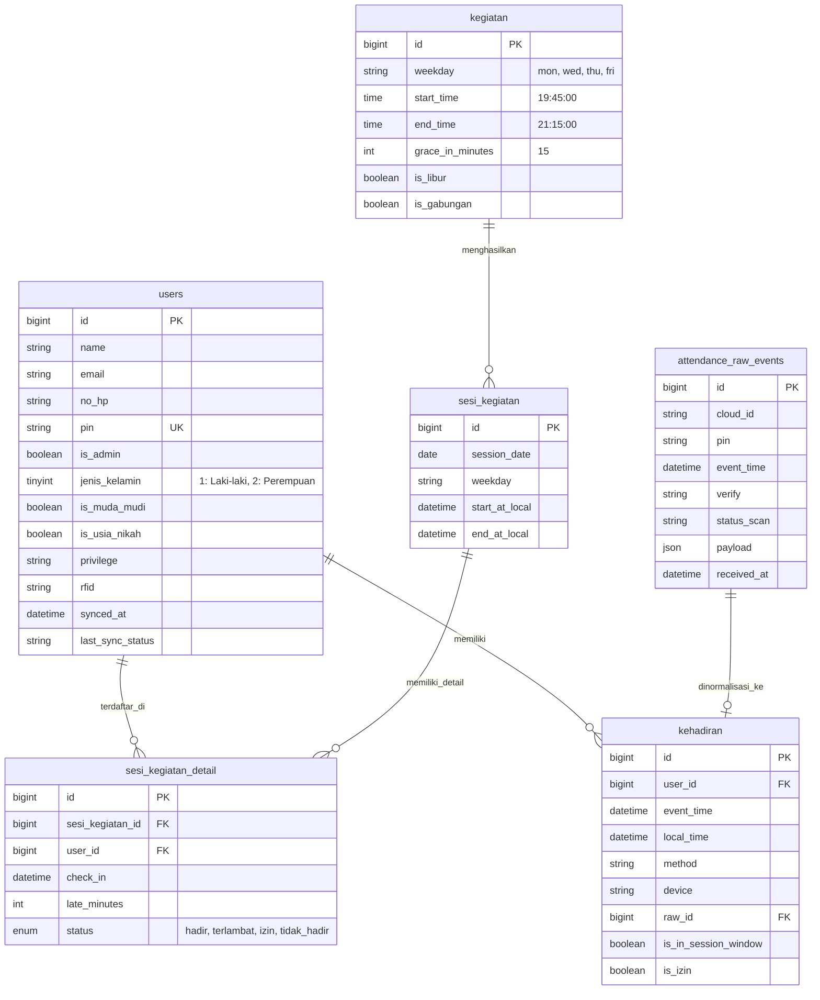

# 📄 Product Requirement Document (PRD)
## SISFO KOBARIN (Sistem Informasi & Presensi Kehadiran Sambung Kelompok)

---

### 1. Document Control & Executive Summary

| Attribute | Detail |
|---|---|
| **Project Name** | SISFO KOBARIN (Sistem Informasi Kota Barat - Presensi Sambung Kelompok) |
| **Framework Version** | Laravel 12 (PHP 8.2+) |
| **Document Version** | 1.0.0 |
| **Status** | Approved / Baseline |
| **Date** | 26 Agustus 2026 |
| **Target System** | Web Application & Background Automation Services |

#### Executive Summary
**SISFO KOBARIN** adalah sistem informasi manajemen presensi dan otomatisasi rekapitulasi kehadiran jamaah pengajian kelompok. Sistem ini mengintegrasikan mesin absensi biometrik (Fingerspot Cloud API) via webhook realtime dengan gateway WhatsApp API untuk rekapitulasi otomatis ke WhatsApp Group Pengurus serta pengiriman pesan pembinaan/konfirmasi personal ke nomor jamaah yang tidak hadir.

---

### 2. System Purpose & Problem Statement

#### Business Goals & Objectives
1. **Otomatisasi Presensi Realtime:** Mengeliminasi pencatatan kehadiran manual dengan memanfaatkan mesin sidik jari/RFID Fingerspot.
2. **Normalisasi & Toleransi Keterlambatan:** Memperhitungkan *grace period* (batas waktu keterlambatan) secara presisi pada setiap sesi pengajian.
3. **Pengelompokan Demografis Jamaah:** Memilah statistik presensi berdasarkan kategori (Bapak-bapak, Ibu-ibu, Mas/Mbak Usia Nikah, dan Muda-Mudi Laki-laki/Perempuan).
4. **Otomatisasi Pelaporan WhatsApp:** Menghasilkan rekapitulasi otomatis dalam format teks terstruktur dengan sapaan sopan islami dan mengirimkannya ke WhatsApp Group pengurus pada jam yang dijadwalkan (21:45 WIB).
5. **Tindak Lanjut Personal Jamaah (Follow-up):** Mengirimkan pesan WhatsApp personal otomatis kepada jamaah yang tidak hadir (21:46 WIB) untuk meningkatkan kepedulian dan keaktifan sambung.

---

### 3. System Architecture & Tech Stack

#### Technical Stack Specification
* **Backend Framework:** Laravel 12.x (PHP ^8.2)
* **Frontend:** Laravel Breeze (Blade Components, Tailwind CSS, Vite, Concurrently)
* **Database:** MySQL 8.0 / SQLite
* **Task Automation:** Laravel Scheduler (`routes/console.php`) & Artisan Commands
* **Integrasi External:**
  * **Fingerspot Cloud API:** API Key + Cloud ID Integration (Sync user & Webhook listener).
  * **WhatsApp API Gateway:** HTTP API JSON Integration for Group & Personal messages.
* **Containerization:** Docker (`Dockerfile`, `docker-compose.yml`, Nginx, PHP-FPM, MySQL).

---

### 4. Data Dictionary & Entity Relationship Diagram (ERD)

---

### 5. Functional Requirements Matrix

#### F-01: User & Demographic Management
* **REQ-1.1:** Admin dapat menambah, mengubah, dan menghapus data jamaah.
* **REQ-1.2:** Sistem secara otomatis mendeteksi PIN berikutnya (`COALESCE(MAX(pin), 0) + 1`).
* **REQ-1.3:** Setiap pembuatan/perubahan user memicu `FingerspotService::setUserInfo()` untuk push data user (PIN, Nama, RFID) ke Cloud Fingerspot.
* **REQ-1.4:** Pengategorian user meliputi:
  * Gender: Laki-laki (`jenis_kelamin = 1`) / Perempuan (`jenis_kelamin = 2`).
  * Kategori: Bapak/Ibu (`is_muda_mudi = 0, is_usia_nikah = 0`), Usia Pra-Nikah (`is_usia_nikah = 1`), Muda-Mudi (`is_muda_mudi = 1`).

#### F-02: Biometric Webhook & Attendance Normalization
* **REQ-2.1:** Endpoint `/api/webhooks/fingerspot` menerima event log scan dari mesin Fingerspot.
* **REQ-2.2:** Memverifikasi `cloud_id` dan `type == 'attlog'`.
* **REQ-2.3:** Menyiapkan log mentah di tabel `attendance_raw_events`.
* **REQ-2.4:** `AttendanceNormalizer` memvalidasi apakah waktu scan berada pada jangkauan waktu pengajian (19:00 - 21:30 WIB) dan belum ada catatan scan sebelumnya pada rentang tersebut untuk mencegah duplikasi.

#### F-03: Attendance Aggregation Engine
* **REQ-3.1:** Artisan command `attendance:aggregate {date?}` dijalankan secara terjadwal atau manual.
* **REQ-3.2:** Menentukan batas toleransi (*grace period*). Jika scan melampaui `start_time + grace_in_minutes`, status dicatat sebagai `terlambat`.
* **REQ-3.3:** Jika pengguna ditandai izin manual (`is_izin = 1`), status menjadi `izin`. Jika tidak ada scan sama sekali, status menjadi `tidak_hadir`.

#### F-04: Automated WhatsApp Group Reporting
* **REQ-4.1:** Command `attendance:send-recap {date?}` menyusun ringkasan kehadiran melalui `GroupNotifier`.
* **REQ-4.2:** Teks rekapitulasi diformat secara otomatis dengan pembagian statistik Hadir, Izin, dan Tidak Hadir per demografi.
* **REQ-4.3:** Mengirimkan teks ke API Gateway WhatsApp Group pada pukul **21:45 WIB**.

#### F-05: Automated Personal WA Follow-Up
* **REQ-5.1:** Command `wa:send-personal {date?}` mengumpulkan nomor HP (`no_hp`) seluruh jamaah berstatus `tidak_hadir` pada tanggal terkait.
* **REQ-5.2:** Mengirimkan pesan pembinaan beretika sopan islami ke masing-masing nomor HP jamaah pada pukul **21:46 WIB**.

#### F-06: Admin Matrix Dashboard
* **REQ-6.1:** Halaman Dashboard menampilkan statistik rekapitulasi kehadiran per sesi pengajian.
* **REQ-6.2:** Data disajikan dalam matriks pemisah kolom Hadir (L/P), Izin (L/P), dan Tidak Hadir (L/P).

---

### 6. Scheduled Automation Matrix (Cron Job Schedule)

| Time (Asia/Jakarta) | Days | Command | Purpose |
|---|---|---|---|
| **21:20 WIB** | Senin, Kamis, Jumat | `php artisan attendance:aggregate` | Menghitung dan merekap status presensi hari tersebut |
| **21:45 WIB** | Senin, Kamis, Jumat | `php artisan attendance:send-recap` | Mengirim pesan rekapitulasi lengkap ke Grup WA Pengurus |
| **21:46 WIB** | Senin, Kamis, Jumat | `php artisan wa:send-personal` | Mengirim pesan perhatian/sapaan personal ke jamaah yang absen |

---

### 7. Non-Functional Requirements & System Constraints

1. **Keamanan & Validasi Token:**
   * Token HTTP Bearer dikonfigurasi via environment variable (`FINGERSPOT_TOKEN`) untuk seluruh komunikasi API ke Fingerspot.
   * Endpoint Webhook mengonfirmasi `cloud_id` dan `cloud_id2` terdaftar.
2. **Kinerja & Reliability:**
   * Retry Mechanism: HTTP Client ke WhatsApp API dan Fingerspot API dikonfigurasikan dengan `retry(2, 500)` dan `timeout(15)` detik.
   * Penanganan error gracefully agar kegagalan gateway API tidak menghentikan siklus agregasi database.
3. **Internasionalisasi & Zona Waktu:**
   * Seluruh komputasi waktu diikat secara eksplisit ke zona waktu `Asia/Jakarta` (WIB).

---

### 8. Roadmap & Enhancements for Future Development

- [ ] **Fase 1 (Current Baseline):** Webhook Fingerspot, Agregasi Presensi, Notifikasi WA Group & Personal, Management User & Presensi Manual.
- [ ] **Fase 2 (Analytics & Reporting):** Grafik tren kehadiran bulanan per kategori di Dashboard, Export laporan presensi ke PDF / Excel.
- [ ] **Fase 3 (Multi-Machine Support & Self-Service):** Dukungan beberapa lokasi mesin absensi dengan Cloud ID berbeda, Portal self-service jamaah untuk permohonan izin via web/WA bot.

---
*Dokumen ini dibuat secara otomatis berdasarkan pemindaian codebase SISFO KOBARIN sebagai panduan acuan standar pengembangan.*
